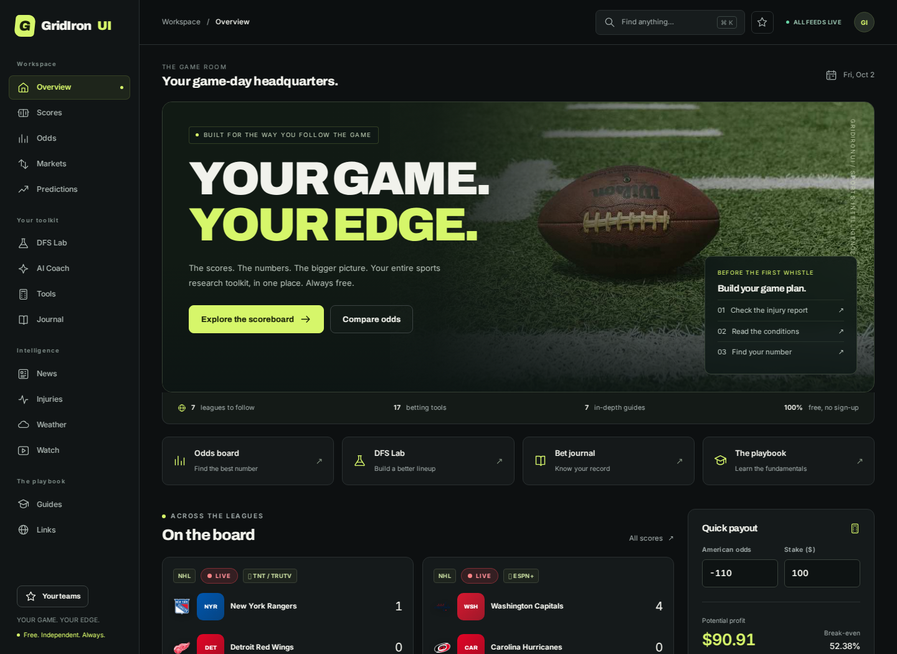

# GridIronUI 2.0 — Upgrade instructions

This ZIP is the complete upgraded repository. It is ready for your existing GitHub Pages setup. There is no build step and no production dependency to install.

## Update your repository

1. Extract `GridIronUI-upgraded.zip`.
2. Open the extracted `GridIronUI-upgraded` folder. `index.html`, `css`, `js`, `data`, `img` and this file belong directly in your repository root.
3. Back up your current repository, then copy these extracted contents over the matching files in your local `GridIronUI.com` checkout. Preserve your checkout's `.git` folder; the ZIP contains no `.git` folder.
4. Commit and push with GitHub Desktop or Git. If using GitHub's **Add file → Upload files**, upload the extracted files and folders, in batches if needed. Include the `.github` folder and `.nojekyll` file.
5. Keep your existing GitHub Pages branch/folder setting. This release does not require switching to an Actions deployment. The included workflow validates the repo; it does not deploy it.
6. After GitHub Pages finishes publishing, refresh the site. Shared assets use new versioned URLs so visitors receive the upgrade.

**Upload the extracted contents, not the ZIP itself.** GitHub Pages does not unpack ZIP files. Avoid nesting everything inside an extra `GridIronUI-upgraded` folder in the repository.

`CNAME` is preserved as `gridironui.xyz`. Existing ad IDs, affiliate links, Bitcoin support address, original photographs and data snapshots are retained. Your current URLs remain valid. The upgrade preserves browser-storage keys used by the journal, team favorites, odds settings and player pools.

## What changed

- One cohesive dark design across all **31 pages**, with a lime accent, football photography, improved spacing, forms, tables and cards.
- Organized desktop sidebar; phone navigation bar and a scrollable full menu.
- Global search for **47 destinations**, including all 17 tools. Open it from the search button, `Ctrl+K` / `⌘K`, or `/`. Use arrows, Enter and Escape.
- A new game-room homepage with quick links, real upcoming/live games, an instant payout calculator and your locally saved journal totals.
- A searchable NFL team picker that writes to the existing favorites list. Homepage highlights refresh immediately; other boards show a reminder to reload after changing teams.
- Clear feed-outage, retry and empty-schedule messages. Unavailable feeds are not presented as a valid empty schedule. Hidden tabs pause homepage refreshes.
- Labeled calculator/DFS fields, a main landmark, keyboard dialogs, reduced-motion support, and better mobile spacing.
- An existing promo-calculator bug fixed: its stake and format inputs no longer collide with the payout calculator's IDs.
- Shared JSON fetching now aborts timed-out requests and also times out stalled response bodies. Homepage news links reject unsafe URL schemes.
- Optional AI Worker updated for the actual custom domain, invalid JSON bodies, UTF-8 body limits and CORS cache variation.
- Portable `npm test`, static-reference checks and a GitHub validation workflow.

## Preview and test locally

Serve the files over HTTP instead of opening `index.html` through `file://`; browser fetches need a local server.

```bash
python3 -m http.server 8080
# Windows with the Python launcher: py -m http.server 8080
```

Open `http://localhost:8080`. Node 20+ is needed only for regression tests:

```bash
npm test
```

No `npm install` is required. See [docs/QA.md](docs/QA.md) for the checks performed.

## Existing services and setup

- **Sports scores, headlines and injuries:** direct ESPN requests; the site handles availability errors.
- **Sportsbook odds:** visitors still supply their own Odds API key on the Odds page. No paid key is included. The key input is now masked.
- **Prediction markets:** Polymarket accessibility depends on its service, CORS and regional access. Existing Kalshi files are timestamped snapshots; the original scripts in `scripts/` can refresh them. This upgrade does not claim those files refresh automatically. Freshness safeguards remain in place.
- **Weather:** Open-Meteo; no device-location permission is requested by these changes.
- **AI Coach:** retains its existing provider fallbacks. `GRID_WORKER_URL` is still blank until you deploy your own optional Worker and set the URL in `js/ai-coach.js`. See [worker/README.md](worker/README.md). This ZIP does not activate a backend or contain secret API keys.
- **Journal / favorites / DFS pools:** remain private browser storage. Export your journal CSV for a durable backup. Data does not automatically sync between devices.
- **Advertising / referrals:** original owner configuration is preserved. Ad serving and provider account approval were not verified.

## Previews

These are QA screenshots, not live data embeds.



[Phone preview](docs/preview-mobile.png)

## Source

Based on `Kshot3000/GridIronUI.com` at commit `badb3f6674fe96991572b00f9e55473cf5e9f38f`.

The ZIP is the deliverable. No changes have been pushed to GitHub or deployed to your live site.
